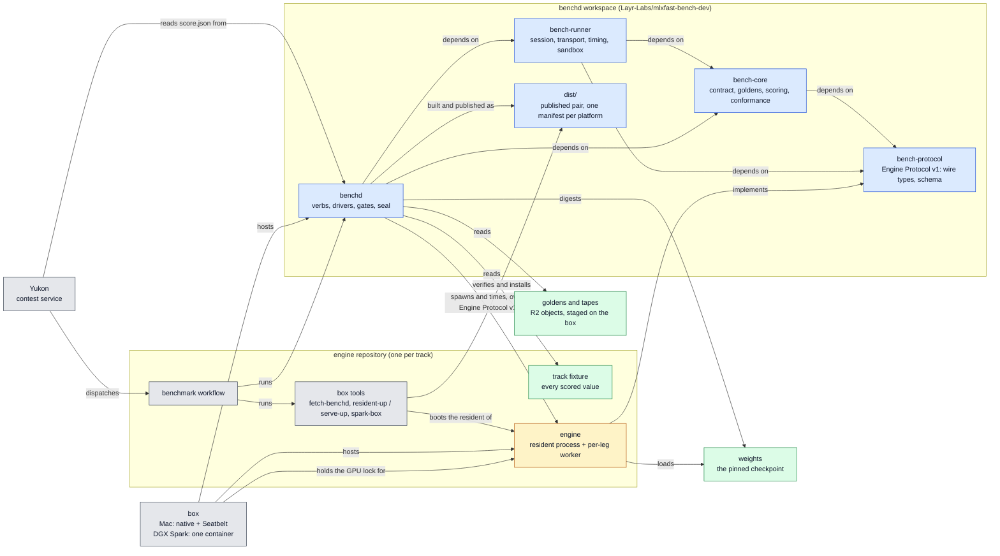

# benchd architecture

The components of the MLXFast benchmark and the relationships between them, as `main` runs
them. Internal, for Layr Labs engineers. Read [`overview.md`](overview.md) first: it walks one
scored run. This page names each component, says what it owns, and says which other
components it depends on.

Each section below is one component. The diagram in section 1 shows the same components and
nothing else.

## 1. Component map

Blue is benchd code. Amber is engine code. Green is material the organizer stages. Grey is
orchestration. Engine Protocol v1 is the trust boundary: benchd is trusted, every engine is not.

| component | section | lives in |
|---|---|---|
| bench-protocol | 2 | `crates/bench-protocol` |
| bench-core | 3 | `crates/bench-core` |
| bench-runner | 4 | `crates/bench-runner` |
| benchd | 5 | `crates/benchd` |
| track fixture | 6 | `fixtures/` in each engine repository |
| goldens and tapes | 7 | R2, staged on the box |
| weights | 8 | staged on the box |
| engine | 9 | each engine repository, built on the box |
| engine repository | 10 | one per track, see section 14 |
| box | 11 | Mac or DGX Spark |
| published pair | 12 | `dist/` on `main` |
| Yukon | 13 | separate service |

## 2. bench-protocol

The crate that defines Engine Protocol v1. It owns the wire types, the JSON Schema and the
normative text [`../crates/bench-protocol/PROTOCOL.md`](../crates/bench-protocol/PROTOCOL.md).
It depends on nothing in the workspace. Every other crate, and every engine, depends on it.

**Transport.** Newline-delimited JSON, one object for each line. The default transport is the
engine's standard input and output. When the engine is a long-lived process that a worker
attaches to, the transport is a Unix socket. A request is `{"id", "kind", ...}`. A response is
`{"id", "nonce", "ok", ...}`. The engine's first line is the `hello`. It carries a session
nonce, the protocol version, the backend and the device, the capabilities and the speculative
modes the engine offers, and, for a Runner-based engine, the Runner's identity and the digest
of its manifest. Every later response echoes the nonce.

**What crosses the wire.** Token numbers, the top eight logits at a position, memory use, and
a few counters. benchd owns tokenization, so the engine never receives text. No time the engine
reports is scored.

**Message kinds.**

| kind | what it does |
|---|---|
| `hello` | The engine announces itself. |
| `prefill` | Read a prompt. Return the next token. |
| `decode_begin`, `decode_step` | Teacher-forced decode. benchd supplies each token. The engine returns the next one. |
| `correctness`, `correctness_begin`, `correctness_step` | The correctness gates. The replies include the top eight logits. |
| `phase_diagnostics` | Close a timed phase. The engine reports the count of steps it completed and the memory its allocator holds. |
| `free_decode_begin`, `free_decode_run` | Free-running decode. The engine produces a run of tokens with its own speculative loop and returns them all. Added in v1.1. |
| `cohort_reference_replay` and the batched forms of the free-running kinds | Several prompts at one time. Added in v1.2. The live tracks do not use them. |

**Rules.** Every addition after v1 is additive. The engine advertises a capability in its
`hello` before benchd uses it. An unadvertised capability is a protocol error, not a fallback.
`decode_step` and `correctness_step` run the same code path. A returned token is computed
already. Any error discards the session. The engine drains its allocator to zero at the start
of each phase, and benchd asserts the drain at each phase close.

## 3. bench-core

The scoring library. It depends on bench-protocol only. It does no I/O to an engine and holds
no clock. Its modules and what each owns:

| module | owns |
|---|---|
| `contract` | The one schema for the track fixture, its parse-time certification, and the resolver for each scored group. Section 6 lists the fields. |
| `golden` | The golden document schema, its digest, and the `target` block with the reference-model pin. |
| `score` | The composite: the speedup floors, the acceptance bands, the weights, and `ScoreMetrics`. |
| `conformance` | The correctness gate: teacher-forced token checks against a golden. |
| `tape`, `free_run` | Recorded free-run tapes and the per-round audit of a free-running decode. |
| `runner_manifest` | The canonical digest of a Runner manifest and the `hello`-against-manifest check. |
| `harness_hash` | The digest of the trusted harness roots, read ahead of the hasher, folded in sorted order. |
| `hash`, `stats`, `near_tie`, `prefill_window`, `cohort_tolerance`, `per_stream_attestation` | Hex rendering, medians and bands, the near-tie rule, the prefill window shape, cohort tolerance, per-stream attestation. |
| `constants` | Protocol invariants, refusal sentinels, the cool-gate temperature for each platform, and platform topology. No scored value lives here. |

## 4. bench-runner

The engine lifecycle library. It depends on bench-protocol and bench-core. It is the only
code that talks to an engine, and it holds the clock.

| module | owns |
|---|---|
| `transport` | The NDJSON line transport: one write and one buffer for each request, the child's stdio, the child-env allowlist, and linear retention of the worker's stderr tail. |
| `session` | The protocol client: the `hello` handshake, nonce and id checks, session discard on error, and the phase-close barrier that asserts `completed_work` and an allocator drained to zero. |
| `timing` | Parent-side wall-clock timing. `Instant` brackets each engine call inside the prefill window, the decode window and the free-run windows. One worker serves one timed window: warm-up prefill, warm-up decode, timed prefill and timed decode run over one session, and the drain is asserted at each close. There is no other lifecycle. |
| `sandbox` | The macOS Seatbelt profile for a spawned engine: no network, no fork or exec, no writes except `/dev/null`, no reads of the private golden, and one exception for an outbound connection to the resident socket named by `BENCH_WORKER_RESIDENT_SOCKET`. |
| `scrub` | Redaction of engine-controlled text before it reaches a sealed artifact. |
| `wire_crosscheck` | Re-parses a sha256-pinned captured wire under benchd's closed structs. |
| `mock` | An in-process engine for the tests and for `record-correctness-golden --backend mock`. It is on no scored path. |

## 5. benchd

The binary. It depends on all three libraries. It owns the verbs, the drivers, the gates, the
per-leg resident boot and the seal. The work is arranged as one job pipeline: parse the
arguments, preflight, run the gates, boot the residency, run the window, check correctness,
assemble the verdict, seal.

**Verbs.** One table-driven parser serves every verb (`FlagSpec` tables, `parse_flags`,
`run_cli` in `main.rs`). A refusal names the flag and prints the usage block.

| verb | driver | what it does |
|---|---|---|
| `iterate --mode official` | `official` | The ranked and official single-leg window. |
| `iterate` (local modes) | `iterate` | The local and submit windows a participant runs. |
| `measure-job` | `measure_job` | The paired and cohort seam of the older tracks, and the batched cohort path. |
| `overlay-timing` | `overlay` | Merges a timed artifact into a sealed score. |
| `calibrate-baseline` | `calibrate` | The unscored calibration passes. |
| `validate-golden`, `validate-weights`, `weights-digest`, `harness-hash`, `correctness`, `parity-diff`, `prefill-decompose` | own modules | Organizer and diagnostic verbs. |

**Gates.** Each gate is one module, called from `main.rs` before any engine starts.

| gate | module | refuses when |
|---|---|---|
| cool gate | `coolgate` | The GPU is above the platform's temperature before a timed phase. It streams the temperature reader and polls finely near the gate. |
| weights preflight | `weights_preflight` | The checkpoint directory is not the declared shape. |
| byte budget | `byte_budget` | The editable surface of a submission is over its budget. |
| write-outside gate | `editable_divergence` | A submission differs from its base outside `editablePaths`. |
| trusted-scope freeze | `trusted_scope` | An editable entry overlaps a trusted file. |
| correctness | `correctness` | The engine's tokens diverge from the golden, or its `hello` disagrees with its manifest. |

**Residency.** `legserve` boots and stops the resident engine of each leg from that leg's own
workspace, through the engine repository's `tools/resident-up.sh` on a Mac and
`tools/serve-up.sh` on a Spark. The spawned worker attaches to the resident of its own leg.

**Digests.** `file_digest` is the one per-file content hash, with a process memo keyed on the
inode, the length and the last-modified nanosecond. The weights digest keeps a sidecar cache
under the user cache directory, scoped to the weights tree. Any changed file, and any damaged
line, is hashed again. The cache changes no sealed value.

**Seal.** `score` writes `score.json`, its bare-basename `.sha256` sidecar, and the integrity
sidecar. `metrics.contract_sha256` is the digest of the fixture bytes that set the rules.
`metrics.contract_sources` has one entry for each resolver group: `"contract"` for a group the
fixture declares, `"device"` for a group the device measures for itself.

**Second binary.** `record-correctness-golden` drives an engine greedy and teacher-forced to
produce the golden document a fixture pins. `measure-noop` measures the stock engine's
per-prompt reference. Both ship in the published pair.

## 6. Track fixture

One JSON file per track, in the engine repository, read by benchd as `--contract`. It is the
only source of every scored value. benchd holds no per-track table. A value the fixture does
not declare is a refusal by name, before any engine starts. `--contract` is required on every
path, local modes included.

benchd reads the fixture one time for each run. `contract::load` parses the bytes and digests
them in one call. It certifies every declared value at parse time: a floor is more than zero, a
pair count is one or more, a batch size is one stream or more, and a half-declared group is
refused.

**Batch size is configuration.** `scored_batch_size` selects the measured path. A width of 1
selects the single-stream path. A width above 1 selects the batched cohort path. Only a width
with a certified series tag can run the cohort path; today that width is 8.

**Fields, by group.** Six groups are all-or-nothing: the scored regime, the official baseline,
the acceptance bands, the scoring weights, the window shape and the model shape. The identity
fields, the paired-run fields and the two speedup floors are each declared on their own.

| group | field | what it declares |
|---|---|---|
| identity | `track_id` | The track the fixture speaks for. It must agree with `MLXFAST_QWEN_MTP_TRACK_ID`. |
| identity | `track_name` | The human label. It is sealed as `track_name`. |
| identity | `official_scoring_enabled` | The arm state. benchd seals a scoring artifact only when it is true. |
| identity | `allowed_modes` | The speculative modes a submission may declare. An empty list is a refusal. |
| identity | `timed_prompt_pool` | The timed prompts, their pins and their per-prompt references. |
| paired run | `official_pairs` | The number of pairs one ranked run measures. |
| paired run | `scores_against_live_control_leg` | Whether the track measures its own denominator. |
| paired run | `paired_flow_retired` | Whether the `measure-job` seam is closed for this track. |
| scored regime | `scored_batch_size` | The batch size of the scored point. |
| scored regime | `prefill_gain_exponent` | The exponent of the prefill gain in the composite. |
| scored regime | `decode_gain_exponent` | The exponent of the decode gain in the composite. |
| official baseline | `official_baseline_prefill_seconds_per_token` | The prefill half of a stored pair. |
| official baseline | `official_baseline_decode_seconds_per_token` | The decode half of the same pair. |
| speedup floors | `decode_speedup_floor` | The decode speedup the scored run must clear. |
| speedup floors | `prefill_speedup_floor` | The prefill speedup the scored run must clear. |
| acceptance bands | `prefill_band_up_tolerance`, `prefill_band_down_tolerance`, `prefill_band_down_enabled` | The prefill band and whether its lower bound is enforced. |
| acceptance bands | `decode_band_up_tolerance`, `decode_band_down_tolerance`, `decode_band_down_enabled` | The decode band and whether its lower bound is enforced. |
| scoring weights | `score_decode_weight`, `score_prefill_weight` | The weights of the published composite. |
| window shape | `correctness_steps` | The checked decode steps the correctness gate evaluates. |
| window shape | `benchmark_decode_steps` | The timed decode depth of the official and local-iterate modes. |
| window shape | `local_submit_benchmark_decode_steps` | The long checked decode the submit path times. |
| window shape | `official_prefill_warmup_runs` | The unmeasured prefill passes before the timed prefill. 0 is a declaration. |
| model shape | `golden_model_type` | The `model_type` the track's goldens declare. |
| model shape | `vocab_size` | The token-id bound every golden, tape and logit stays inside. |
| model shape | `num_hidden_layers` | The decoder-layer count, sealed as `metrics.num_layers`. |
| model shape | `seed_tokens` | The seed length of the correctness prompt, the timed prefill prompt and the decode seed. |

The fixture also holds the `target` block with the reference-model pin and the golden pins.
`bench_core::golden` reads those.

**What each track declares.** The 125B tracks declare no official baseline pair and no scored
regime. Each device measures its own reference: the run measures the serial-control leg on
that box in the same job as the scored leg, and the reference stays on that device. benchd
does not upload it and does not store it centrally. Those tracks declare the window shape
instead; `official_prefill_warmup_runs` is 1 on the Mac track and 0 on the CUDA track. The 27B
track declares the pair and the regime and no window shape. Every track declares the bands,
the weights and the model shape. `crates/benchd/tests/fixtures/contract-full/` holds one full
fixture for each track, and a test proves each resolves to the expected values beside it.

## 7. Goldens and tapes

The recorded answers a run is checked against. A golden is a teacher-forced token record with
the top eight logits at each position, authored by `record-correctness-golden`. A tape is a
recorded free-running decode. Both are organizer material: R2 objects, staged on the box by an
operator, pinned by sha256 and byte count in the track fixture, and never stored in git.

benchd reads a golden through `bench_core::golden`, verifies the pin, and holds the digest for
the integrity sidecar. The engine never sees a golden: benchd tokenizes and sends token numbers
only, and the Seatbelt profile denies the engine a read of the private golden as well.

## 8. Weights

The pinned checkpoint of the reference model, staged on the box by an operator. benchd digests
the tree before the first engine starts (`weights-digest`, `dir_digest_weights`) and seals the
digest as `weights_hash`. The engine's resident process loads the checkpoint one time for each
leg and holds it for the whole timed window.

## 9. Engine

The untrusted side of the wire. Every engine is two processes.

| | Mac (MLX) | DGX Spark (CUDA) |
|---|---|---|
| resident | `bench-worker resident`, holds the checkpoint, listens on a Unix socket | `ds4-resident`, holds the checkpoint, listens on a Unix socket |
| per-leg worker | `track-bench-worker`, spawned by benchd for each leg, attaches to the resident | `cuda-engine`, the Rust adapter over ds4, spawned by benchd for each leg, attaches to the resident |
| model code | a Runner: one Swift type per model family in `Libraries/MLXRunners` of `Layr-Labs/mlx-swift-lm`, built on CBv2, the fork's continuous-batching core; the track's editable copy is `Runner/` | `Layr-Labs/ds4`, the port of `antirez/ds4`, and the adapter in `harness/protocol-adapter` |

The engine implements Engine Protocol v1 and nothing else connects it to benchd. It reports
raw counters only. It resets itself at the start of each measured phase: it re-attests, resets
the cache limit and drains its allocator; benchd asserts the drain at each phase close. A
third-party engine takes part over the same wire by speaking the protocol and shipping a
manifest.

## 10. Engine repository

One per track. It owns the track fixture (section 6), the engine source or its pins (section
9), the MTP head, the list of files a participant may edit, the benchmark workflow Yukon runs,
and the box tools:

| tool | what it does |
|---|---|
| `tools/fetch-benchd.sh` | Downloads the manifest from `dist/` on benchd `main`, then the binaries, verifies each sha256 and byte count, and installs the pair on the box. |
| `tools/resident-up.sh` (Mac), `tools/serve-up.sh` (Spark) | Boots and stops the resident engine of a leg. benchd calls them through `legserve`. |
| `tools/spark-box/` (CUDA) | The Dockerfile, entrypoint and `converge.sh` that make one container the whole box side. |
| the measure-and-score script | The workflow's entry: runs benchd on the box and leaves `score.json` for the workflow to upload. |

An engine repository never builds benchd.

## 11. Box

The machine a track runs on. It hosts benchd and the engine and holds the GPU lock.

| | Mac box (MLX) | DGX Spark box (CUDA) |
|---|---|---|
| engine process | native, under the Seatbelt profile | native inside the box's one container |
| box posture | the operator stages the tools and the weights on the host | one container is the Actions runner, the toolchain and the engine build |
| GPU lock | `/tmp/mtplx-gpu-exclusive.lock` on the host | the same path and `flock` discipline, in the container's own `/tmp` |
| benchd | the verified pair on the host | the verified pair on a read-write mount at `/opt/benchd-bin` |
| weights | staged on the host | a read-only mount at `/weights` |
| goldens | staged from R2 on the host | a read-only mount at `/goldens` |
| git for the gates | `/usr/bin/git` | `/usr/bin/git` |
| runbook | [`runbook-box-setup-mlx.md`](runbook-box-setup-mlx.md) | [`runbook-box-setup-cuda.md`](runbook-box-setup-cuda.md) |

The container is the only GPU user on a Spark box. A scored run on the 125B tracks is paired
and runs on one box: each pair is a serial-control leg on the organizer-staged reference tree,
then the candidate leg, so the denominator is measured in the same run as the candidate.

## 12. Published pair

`main` is the channel. `dist/` on `main` carries `benchd` and `record-correctness-golden` for
three platforms: macOS aarch64 at `dist/`, Linux aarch64 at `dist/linux-aarch64/`, Linux
x86_64 at `dist/linux-x86_64/`. Each directory holds a `benchd.manifest.json` that names the
branch, the source commit, the target triple, the sha256 and the byte count. The publish
procedure and the release checklist are in [`../README.md`](../README.md).

**Deploy order.** A benchd built from `main` refuses a fixture that does not carry the keys of
a group it needs. Publish the engine fixtures first, with the public cut of each engine
repository. Publish the benchd that requires them second.

## 13. Yukon

The contest service. It takes submissions, dispatches the engine repository's benchmark
workflow to a box, and reads the `score.json` the workflow uploads. It is a separate codebase.
Nothing in this workspace links to it; the sealed `score.json` is the whole interface.

## 14. Tracks

| track | engine repository | engine | denominator |
|---|---|---|---|
| Qwen 3.8 125B-A6B, Mac | `Layr-Labs/mlxfast-qwen38-125b-a6b-engine` | `track-bench-worker` over the track's `Runner/`, on the fork library | live control leg, prefill and decode |
| Qwen 3.8 125B-A6B, CUDA | `Layr-Labs/cudafast-qwen38-125b-a6b-engine` | the `cuda-engine` adapter over ds4 | live control leg, prefill and decode |
| Qwen 3.8 27B, Mac | `Layr-Labs/mlxfast-qwen-38-27b-mtp-engine-dev` | hand-written, older form | stored pair, decode only |
| Gemma 4 26B-A4B, Mac | `Layr-Labs/mlxfast-gemma4-26b-a4b-engine-dev` | hand-written, older form | stored pair, decode only |

What a participant may edit comes from each repository's own editable list. On the 125B Mac
track it is the depth declaration, the weight transform, the listed Metal kernel files in the
vendored MLX core, and the Runner, the MTP head module and its drafter in `Runner/`. On the
125B CUDA track it is ds4, the adapter and the MTP head. On the two older tracks it is the
model code, the weight transform, the MTP head and the model files in the vendored fork copy.

The older tracks score through the `measure-job` seam. A batched cohort there computes a
composite, and the composite is the published score. A cohort that accepted one pair or more
and cannot compute a composite refuses the whole run and seals no partial result.

## 15. Open items

| item | state |
|---|---|
| Fork pull request 140: the Runner stack (`MLXRunners`, `bench-worker`, the Qwen 3.8 Runner). The 125B Mac engine pins a commit of its branch. | open |
| Move the model implementation files into `Runner/` and re-pin the engine to the head of that branch. | not started |
| A third-party SDK crate beside `bench-protocol`: the NDJSON loop, the hello builder, nonce and barrier handling over an `Engine` trait. | not started |
| Publish `dist/` by continuous integration. Today an operator publishes it by hand from `main`. | not started |
| Decide whether the model implementation files, and not only the Runner, become editable. | decision |
| Decide on one score definition. The older tracks score decode only. The 125B tracks score prefill and decode. | decision |
| Migrate the two older tracks to the current architecture, or retire them. | decision |

## 16. Related documents

- Read first: [`overview.md`](overview.md).
- The protocol: [`../crates/bench-protocol/PROTOCOL.md`](../crates/bench-protocol/PROTOCOL.md).
- The runner boundary: [`runner-contract.md`](runner-contract.md).
- Adding a track: [`runbook-new-engine.md`](runbook-new-engine.md).
- Setting up a box: [`runbook-box-setup-mlx.md`](runbook-box-setup-mlx.md),
  [`runbook-box-setup-cuda.md`](runbook-box-setup-cuda.md),
  [`qwen38-125b-a6b-baseline-capture.md`](qwen38-125b-a6b-baseline-capture.md).
- The original design proposal: [`history/architecture-split-design.md`](history/architecture-split-design.md).
