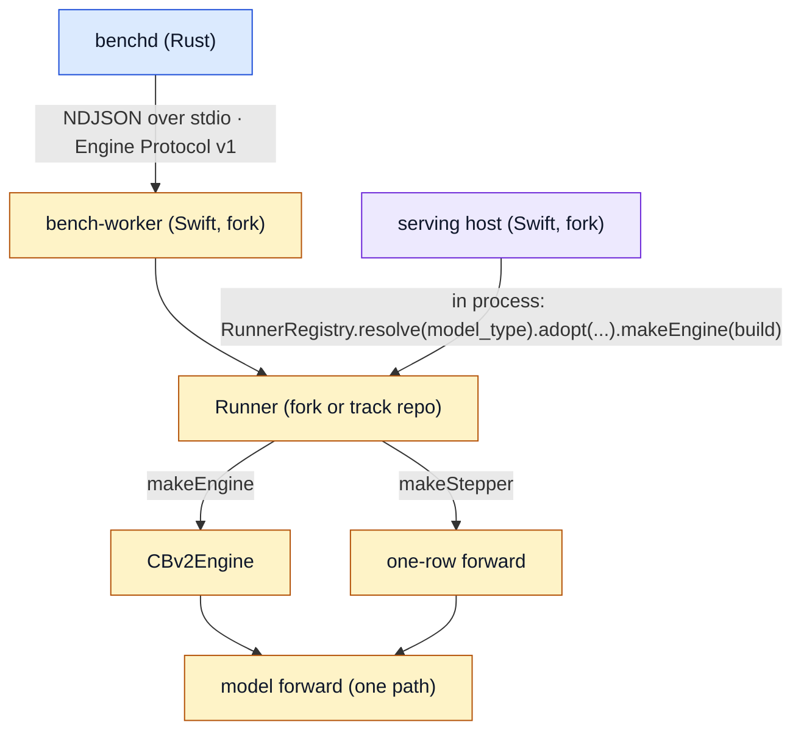

# Runner contract

**Class:** normative contract, **DRAFT v0.3 (2026-09-05), not yet ruled.** The code cites this
page by section number (`runner_manifest.rs` §6, §6.1, §13; `engine_resource.rs` §8.1, §13b;
`correctness.rs` §13). Section numbers are stable; do not renumber. The working draft with the
port-lane history lives outside this repo; this page is the benchd-facing text.

Cites mlx-swift-lm fork `c4089870` and this repo at `06ba6a8`.

## 1. Purpose

This document defines the runner boundary. A runner is one model family behind the CBv2
engine, with a static manifest. Two consumers drive a runner:

- a serving host in the fork, in process.
- benchd, through the generic `bench-worker` executable, over Engine Protocol v1.

One runner, one manifest, two consumers. No consumer carries family-specific construction
code.

## 2. Terms

| term | meaning |
|---|---|
| runner | A Swift type that conforms to `Runner`. It loads one checkpoint and produces an engine and a stepper. |
| manifest | Static data on the runner type. It declares what the runner can do. Hello fields derive from it. |
| engine | A `CBv2Engine` built over the runner's model. Free-run, cohort, replay. |
| stepper | A single-row, teacher-forced forward over the same model. benchd's v1 timed verbs. |
| bench-worker | The Engine Protocol v1 server. The server library and the fork's own executable live in the fork; a track repo builds its own executable (`track-bench-worker`) on that library so it can register its editable runner first. |
| first-party runner | A runner in the fork. The fork's serving host resolves it through the registry. |
| track runner | The same runner file in a track repo's `Runner/` directory, editable. It registers itself in `RunnerRegistry` and shadows the fork's built-in runner. Promoted into the fork when accepted. The 125B Mac track has carried one since engine PR 4 (2026-09-09), with the MTP head module and its drafter beside it. |

## 3. Layers



benchd never links a runner. The serving host never contains family switches.

## 4. Package layout in the fork

```
Libraries/MLXRunners/
  Runner.swift              protocol Runner, RunnerManifest, EngineBuild, RunnerLoadOptions
  RunnerRegistry.swift      model_type -> runner type
  Stepper.swift             protocol TeacherForcedStepper
  BenchWorker.swift         the Engine Protocol v1 server (+ BenchWorkerWire.swift)
  Gemma4TextRunner.swift
  GPTOSSRunner.swift
  Qwen35Runner.swift        dense + MoE
  Qwen3VLRunner.swift
  Qwen4ExpRunner.swift      Qwen 3.8 Flash-Next 125B-A6B (first runner under this contract)
Executables/bench-worker/
  main.swift                thin shim over Libraries/MLXRunners/BenchWorker.swift
```

A track repo mirrors the last two pieces: `Runner/<Family>Runner.swift` (its editable copy) and
`Sources/BenchWorker/main.swift` (the same shim plus one `RunnerRegistry.shared.register` call
before resolution), built as the product `track-bench-worker`. SwiftPM builds a dependency's
product over a root product of the same name without warning, so the track's product must not
be named `bench-worker`.

`MLXRunners` depends on `MLXLMCommon`, `MLXLLM`, `MLXVLM`. It does not depend on the serving
host. The serving host depends on `MLXRunners`. Family functions that used to live in the engine
directory move into the family's runner file; the engine directory keeps no family name.

## 5. `Runner`

```swift
public protocol Runner: AnyObject, Sendable {
    /// Static declaration. See section 6.
    static var manifest: RunnerManifest { get }

    /// Load the checkpoint. Loads weights ONCE. No download. No network.
    /// `options` carries the drafter directory (assistant checkpoints), the
    /// KV byte capacity, resources (section 8.1), and the environment the
    /// caller wants honored. Default implementation: load the container, then adopt.
    static func load(_ directory: URL, options: RunnerLoadOptions) async throws -> Self

    /// Adopt an ALREADY-LOADED model. The serving host's slot lifecycle owns a
    /// resident ModelContainer; loading again would double the weights. Reads no tensors.
    static func adopt(model: any LanguageModel, tokenizer: any Tokenizer,
                      configuration: ModelConfiguration, directory: URL,
                      options: RunnerLoadOptions) throws -> Self

    /// The serving model after tower extraction (VLM text tower, MoE target).
    var servingModel: any LanguageModel { get }
    var tokenizer: any Tokenizer { get }
    var eosTokenIDs: Set<Int> { get }

    /// Per-layer attention structure. Model-owned. One entry per model layer.
    var layerKinds: [CBv2LayerKind] { get }

    /// Which decoders actually loaded. Subset of `manifest.decoders`.
    /// A decoder is present only if its drafter is resident.
    var loadedDecoders: [DecoderID] { get }

    /// Provenance of the loaded drafter artifact, if any. Sealed on hello.
    var headProvenance: HeadProvenance? { get }

    /// Build the engine. Free-run, cohort, reference replay, serving.
    /// `build` carries policy the CALLER owns. The runner supplies the model,
    /// caches, layer kinds, capabilities, and drafter.
    func makeEngine(_ build: EngineBuild) throws -> any CBv2Engine

    /// Build a single-row teacher-forced stepper over the SAME forward.
    func makeStepper() throws -> any TeacherForcedStepper
}
```

Rules:

1. `makeEngine` and `makeStepper` share one model instance and one forward. The stepper is
   not a second implementation.
2. The runner holds no timer. It reports counters only.
3. The runner never tokenizes on the benchd path. Token ids cross the boundary.
4. The runner never reads the network.
5. Policy stays with the caller: the serving host passes its KV sizing, slot vetoes, paged
   preflight results, SSD prefix cache; bench-worker passes a fixed contiguous build.

## 6. `RunnerManifest`

Static data. Codable. Digest-stable: field order and names are frozen once ruled.

```swift
public struct RunnerManifest: Sendable, Codable, Equatable {
    public let schemaVersion: Int             // 1
    public let runnerID: String               // vendor-namespaced, e.g. "layr/qwen4exp-125b-a6b"
    public let modelTypes: [String]           // config.json model_type values this runner claims
    public let backend: String                // "mlx" for every fork runner
    public let engine: CBv2ModelCapabilities  // MANDATORY explicit declaration, no defaults
    public let kvBackends: [KVBackendKind]    // subset of [.contiguous, .paged]
    public let decoders: [DecoderDeclaration]
    public let regimes: [RegimeDeclaration]
    public let multimodal: Bool
    public let recurrentLayers: Bool
    public let requiresKeepMask: Bool         // section 10
}

public struct DecoderDeclaration: Sendable, Codable, Equatable {
    public let mode: String                   // "serial" | "mtp" | "dflash" | "dspark"
    public let drafter: DrafterKind           // .none | .embeddedHead | .assistantCheckpoint | .ngram
    public let state: DrafterState            // .stateless | .requestStateful
    public let depth: ClosedRange<Int>?       // nil for serial
}

public struct RegimeDeclaration: Sendable, Codable, Equatable {
    public let batch: BatchDeclaration        // .single | .upTo(Int)
    public let timing: TimingKind             // .freeRun | .teacherForced
    public let perStreamTiming: Bool
}
```

The Rust side is `bench_core::runner_manifest::RunnerManifest`, with the same fields in the
same order and `deny_unknown_fields`.

### 6.0 Wire encoding and canonical digest

JSON encodings, identical on the Rust and Swift sides:

- `batch`: the string `"single"`, or the object `{"upTo": n}`.
- `depth`: the array `[lo, hi]`, or `null` for serial.
- Enum-like fields (`drafter`, `state`, `timing`, `kvBackends[]`) are lowerCamelCase strings
  exactly as named in section 6.

Canonical digest: serialize the parsed manifest in the declared section 6 field order,
nested objects in their declared order, keys never sorted, compact UTF-8 with no whitespace,
absent `depth` as `null`; then sha256, lowercase hex. `bench-worker manifest --runner <id>
--digest` prints it; `bench_core::runner_manifest` computes it.

Test vectors for the section 11 manifest:

| depth range | digest | where pinned |
|---|---|---|
| `[1, 3]` | `474efd9965aef3453e1e8324e99f9711d8e44bb2dceb0366d9c14c7d8e9ecebe` | `bench_core::runner_manifest::QWEN4EXP_125B_A6B_MANIFEST_SHA256` |
| `[1, 6]` | `0430b22f8325c9c9371910d1e14eb3c78b235932bf35fa6623a4c511dd68e180` | the fork at 5891033; the live runner |

**Known divergence.** The live runner declares `[1, 6]` (David 2026-09-04: cap MTP at 6 on
both platforms). This repo's test vector still pins the `[1, 3]` manifest. The vector is a
test of the digest algorithm, not a gate on any run, so nothing refuses; re-pin it when the
fields freeze.

On the wire, `runner` is the last field of the `hello` response, appended after every earlier
additive field. The conformance-kit entry point is `benchd correctness --manifest <path>`.

### 6.1 Derivation to `hello`

bench-worker computes every hello field from the manifest and the loaded state. No runner
writes a hello field by hand.

| hello field | derived from |
|---|---|
| `protocol_version` | constant 1 |
| `backend` | `manifest.backend` |
| `device` | Metal device name probe, pre-hello |
| `spec_modes` | `runner.loadedDecoders` mapped to `mode` strings: `manifest.decoders` minus unloaded drafters |
| `capabilities` | `free_run_decode` if any regime has `timing == .freeRun`; `batched_free_run_decode` if any regime has `batch == .upTo(n)` with `n > 1`; `per_stream_timing` if any regime declares it; `cohort_reference_replay` only in the trusted build |
| `max_batch_size` | max `n` over `.upTo(n)` regimes; absent if all regimes are `.single` |
| `head_provenance` | `runner.headProvenance` |
| `runner` | `{ id: manifest.runnerID, model_type: loaded config model_type, manifest_sha256: canonical digest, build: fork commit }` |
| `resident` | `{ pid, load_epoch }` when the worker attached to a resident; absent when it loaded the weights itself |

### 6.2 Rules

1. A mode is advertised only if its drafter loaded. A worker that resolves a mode it did not
   advertise is a bug, not a fallback.
2. `engine` capabilities are explicit. A default is not accepted for a manifest.
3. A regime the runner cannot serve is omitted. It is never withheld by a constant in the
   worker.
4. The serving host's advertise gate is `RunnerRegistry.contains(model_type)`. The hand-kept
   list of supported models is deleted.

## 7. `TeacherForcedStepper`

```swift
public protocol TeacherForcedStepper: AnyObject {
    /// Fresh session. Allocator drained by the caller before this.
    func begin() throws
    /// Forward `tokens` at the current position. Returns logits of the
    /// LAST position only, as a top-k list plus argmax. k = 8.
    func forward(_ tokens: [Int]) throws -> StepOutput
    /// Number of forwards executed since begin(). Reported as completed_work.
    var forwards: Int { get }
}

public struct StepOutput: Sendable {
    public let argmax: Int
    public let topLogits: [(token: Int, logit: Double)]  // sorted, k entries
    public let margin: Double                            // top - second
}
```

Argmax tie-break: lowest token id. Same rule for engine and stepper.

## 8. Verb mapping in bench-worker

| verb | product | call |
|---|---|---|
| `hello` | manifest | section 6.1 |
| `prefill` | stepper | `begin()`; `forward(prompt).argmax` |
| `decode_begin` | stepper | `begin()`; `forward(seed).argmax`; forwards += 1 |
| `decode_step` | stepper | `forward([token]).argmax` |
| `correctness` | engine | `submit(maxTokens: steps, greedy, stopTokens: [])`; collect the delta tokens |
| `correctness_begin` | stepper | `begin()`; `forward(prompt)` with `topLogits` |
| `correctness_step` | stepper | `forward([token])` with `topLogits` |
| `free_decode_begin` | engine | build engine with spec; one seed submit per stream; seed argmax per stream |
| `free_decode_run` | engine | drain N tokens per stream; audit from the MTP metrics and round audits |
| `cohort_reference_replay` | engine, trusted build | teacher-forced top-1 replay per stream |
| `phase_diagnostics` | worker | `Memory.clearCache()`, assert `cacheMemory == 0`, report counters |

`decode_step` and `correctness_step` call the same `forward`. This is the invariant the
architecture page names as non-negotiable.

Audit fields reported on free-run responses, all from engine counters, never computed:
`spec_decoder`, `drafted_total`, `accepted_total`, `committed_total`, `acceptance_lengths`,
`natural_accepted_by_stream`, `rounds`, `active_streams_by_round`, `depth_clamp_reasons`,
`verify_replay_disagreements`, `verification_mode`, `rectangular_verification_rounds`,
`serial_verification_rounds`.

### 8.1 bench-worker arguments

```
bench-worker --weights <dir> [--runner <id>] [--drafter <dir>] [--trusted]
             [--speculative-protocol v1.1] [--resource <name>=<path>]...
bench-worker manifest (--runner <id> | --weights <dir>) [--digest]
bench-worker resident ...        (holds the weights; phase workers attach, see `qwen38-125b-a6b-baseline-capture.md` §7)
```

- `manifest` prints the canonical manifest bytes (section 6.0) or only the sha256. It reads
  `config.json` only, never weights.
- `--speculative-protocol`: benchd's official spawn always appends `v1.1`. Exactly `v1.1` is
  accepted; any other value refuses by name before load. Present: the hello advertises the
  manifest-derived speculative surface and `effective_spec` is echoed. Absent: plain v1; the
  hello omits `spec_modes` and the free-run capabilities, and a `spec` on `decode_begin` or
  `free_decode_begin` refuses by name.
- `--runner` absent: resolve by the checkpoint's `config.json` `model_type` through the
  registry.
- `--resource` is repeatable; each becomes one entry on `RunnerLoadOptions`. A duplicate
  name refuses. A path that is not an existing file or directory refuses. Both refusals
  happen before load, by name. Values are opaque to the worker. The engine repository's
  wrapper appends them from the track fixture, never from a submission-editable path, through
  benchd's `--engine-resource` (section 13b). First use: `qwen4exp.ngramRowSource=<dir>`.

## 9. `EngineBuild`

```swift
public struct EngineBuild: Sendable {
    public var kvBackend: KVBackendKind          // caller chooses; runner refuses if not in manifest.kvBackends
    public var kvBytesCapacity: Int
    public var schedulerConfig: CBv2SchedulerConfig
    public var loopConfig: CBv2EngineLoopConfig
    public var prefixCache: (any CBv2PrefixCache)?
    public var decoder: DecoderID                 // must be in runner.loadedDecoders
    public var mtpConfig: CBv2MTPConfig
    public var environment: [String: String]
}
```

bench-worker's build is fixed: contiguous, `maxConcurrentRequests == batch`, no prefix cache,
no waiting queue, no stop tokens on cohort requests. The serving host's build is whatever its
slot factory computes.

## 10. CBv2 seam: `keepMask`

Required by Qwen 3.8 Flash (QSA sparse attention, indexer budget 2048).

- `CBv2AttendingLayerCache.updateAndAttend(...keepMask:)` gains an optional per-row boolean
  keep mask, default nil. Existing conformers are untouched.
- `CBv2LayerCacheProvider.supportsKeepMask: Bool`, default false. The engine refuses at
  construction when a runner declares `requiresKeepMask` and the provider does not support it.
- The contiguous backend honors it. The paged backend refuses by name.
- The indexer key tape is a second per-row tape inside the family's own layer cache, so trim
  and rollback keep it in step with KV. MTP rollback depends on this.

## 11. First runner: Qwen 3.8 Flash-Next 125B-A6B

```json
{
  "schemaVersion": 1,
  "runnerID": "layr/qwen4exp-125b-a6b",
  "modelTypes": ["qwen4_exp", "qwen4_exp_text"],
  "backend": "mlx",
  "engine": {
    "supportsPrefixReuse": false,
    "supportsPagedKV": false,
    "supportsCompiledDecode": false,
    "supportsPackedPrefill": false,
    "supportsMTP": true,
    "supportsCompactRecurrentMTPReplay": false
  },
  "kvBackends": ["contiguous"],
  "decoders": [
    { "mode": "serial", "drafter": "none", "state": "stateless", "depth": null },
    { "mode": "mtp", "drafter": "embeddedHead", "state": "requestStateful", "depth": [1, 6] }
  ],
  "regimes": [
    { "batch": "single", "timing": "freeRun", "perStreamTiming": false },
    { "batch": "single", "timing": "teacherForced", "perStreamTiming": false }
  ],
  "multimodal": false,
  "recurrentLayers": true,
  "requiresKeepMask": true
}
```

The depth cap is policy, not structure (one head applied once per draft step). Cohort regimes
are omitted on purpose: the track is ruled single-stream, and the engine cannot serve the QSA
mask at width above 1 until section 10 is proven there.

Model facts the runner owns: 12 full-attention layer kinds with mapped `modelLayerIndex`; the
recurrent state spec for the 36 GDN layers; the n-gram PLE history as an integer slot on the
recurrent spec under synthetic layer indices past the last real layer; the embedded `mtp.*`
head through the same seam Qwen 3.5 uses. Two parity rules learned on the box: the
checkpoint bakes the RMSNorm weight offset (`rms_norm_weight_offset: 0` in the transformed
config, validated at adopt), and the PLE gate must stay in the model dtype.

## 12. Acceptance for a runner

1. `swift test` in the fork: manifest digest pinned, hello derivation table pinned, stepper
   and engine argmax agree on a fixture prompt.
2. benchd conformance kit against `bench-worker` with the track's public golden: protocol
   conformance, anchor gate, free-run exact match, `--manifest` checks.
3. Token equality: `bench-worker` free-run tokens equal the recorded goldens on both legs.
4. Serving host: the model loads through the registry, serves a local chat request,
   `mtp_active` true when the head is present.
5. One calibration run at the end on the secured tip, not per iteration.

## 13. What benchd changes

- `WorkerResponse.runner: Option<RunnerIdentity>`, additive, hello only. Schema updated.
  Sealed like `head_provenance`.
- `WorkerResponse.resident: Option<ResidentIdentity>`, additive, hello only. Sealed; a change
  inside one window is refused.
- The conformance kit accepts a manifest path and checks the hello against it.
- Nothing in scoring.

### 13a. Third-party SDK

No such crate exists. The earlier draft was deleted as dead code. These are the terms a
replacement takes, not a description of shipped work.

1. Consumption: a git dependency pinned by SHA, the same way a track repo pins benchd.
   Never vendored. `publish = false` until David rules on a license (MIT recommended).
2. Spec modes: the SDK is to derive `spec_modes` from the manifest's decoders, an open
   string set. The first lift ships two-arm (`serial`, `mtp`); the follow-up makes it
   manifest-driven so `dflash` and `dspark` need no SDK change.
3. `FREE_RUN_MAX_COUNT` (1536) is a track value, not an SDK constant. Builder parameter now;
   it moves to the track file with the other per-track values.
4. Shared conformance fixture: `crates/bench-protocol/schema/engine-wire-v1-adapter.ndjson`.
   The Rust adapter re-emits it byte for byte; the Swift `bench-worker` test replays it byte
   for byte. One fixture, two implementations.

### 13b. benchd resource passthrough

`benchd iterate/correctness --engine-resource NAME=PATH` (repeatable) is forwarded to the
worker as `--resource NAME=PATH` in the spawn extra args. The value comes from benchd's own
command line as invoked by the engine repository's wrapper, never from a submission-editable
file. benchd checks the name and the shape only; the worker validates existence and refuses
by name.

### 13c. Official sandbox and the resident socket

macOS Seatbelt treats an AF_UNIX connect as `network*`, and the official worker profile
denies all network. When the spawned environment carries `BENCH_WORKER_RESIDENT_SOCKET`, the
derived profile gains exactly one rule, an `allow network-outbound` to that one Unix socket
path, placed after `(deny network*)`. Nothing else opens. With the variable absent the profile
is byte-identical to the profile without a resident. On the paired path the profile is built
per spawn from that leg's socket, so each leg reaches its own resident and nothing else.

## 14. Open items for David

1. Field names in `RunnerManifest` freeze on first ruling. Until then this is a draft.
2. Where the track repo's editable surface points now that `Runner/` is local files and the fork
   is a submodule. The runner file, the MTP head module and its drafter are editable as of
   engine PR 4 and the commit that followed it; the model implementation files are not,
   pending the model-file move (fork PR 143 opened the seven declarations they need).
3. The third-party SDK license.
4. Cohort regimes on the first runner (needs section 10 at width above 1).
